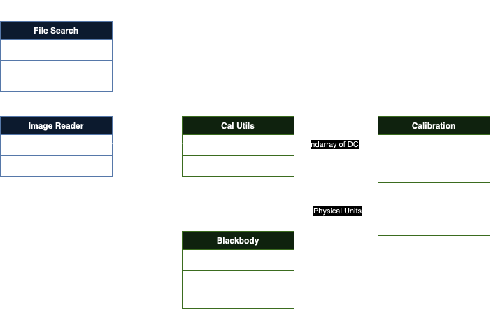

# sUAS Calibration Scripts

This repository contains scripts for calibrating small Unmanned Aerial Systems (sUAS) cameras. The scripts are designed to process and analyze camera data to ensure accurate calibration.



## Features

- Automated calibration process
- Visualization of Flight Data

## Installation

1. Clone the repository:
    ```bash
    git clone https://github.com/yourusername/sUAS-calibration-scripts.git #Skip if using Github UI
    ```
2. Navigate to the project directory:
    ```bash
    cd sUAS-calibration-scripts 
    ```
3. Set up Conda Env
    ```bash
    conda env create --name thermal_cal --file environment.yml
    ```
4. Activate the Conda Env
    ```bash
    conda env activate thermal_cal
    ```
5. Install the package in editable mode:
    ```bash
    pip install -e.
    ```


## Usage

1. Prepare your camera data and place it in the `data/cam_sheets` directory. Make sure it adhears to the format of the example .csv file
2. Run the calibration script (Remember to input args for your own files):
    ```bash
    python radiometric_calibration.py #This will save the calibration coeffs, remember to input args!
    ```
3. Review the output in the results folder

## Contributing

Contributions are welcome! Please fork the repository and submit a pull request with your changes.

## Contact

For any questions or issues, please open an issue on GitHub or contact the project maintainer.

